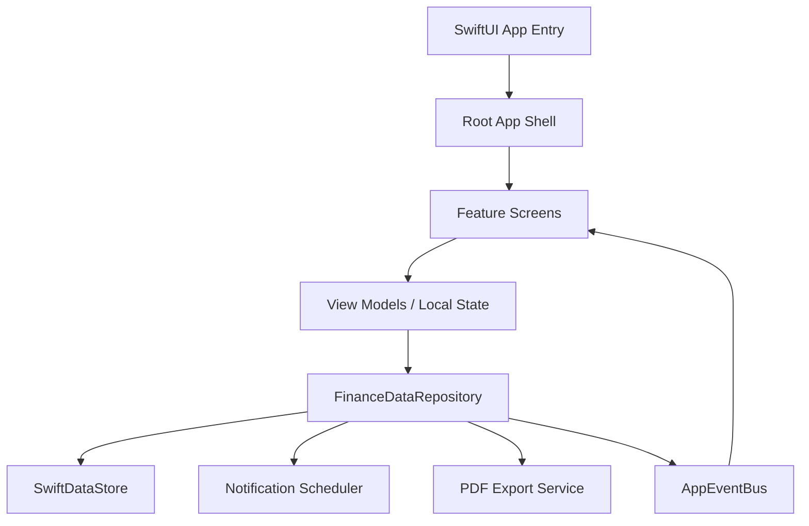

## Fintrax 


Fintrax is a personal finance iOS app built with SwiftUI. It helps users track expenses, budgets, categories, income, payment reminders, analytics, and verified PDF reports from one professional finance workspace.


## Tech Skills Demonstrated

| Area | Skills / Tools |
| --- | --- |
| iOS Development | Swift, SwiftUI, SwiftData, Foundation, UIKit integration |
| Architecture | MVVM-oriented screens, repository pattern, event bus, feature-based modules |
| Persistence | SwiftData models, local storage, migration-friendly data services |
| UI/UX | Custom design system, dark/light themes, animated onboarding, professional finance dashboards |
| Charts & Analytics | Category breakdowns, monthly trends, local AI-style spending insights |
| Notifications | UserNotifications, local reminders, app icon badges, repeat-until-complete scheduling |
| PDF Reporting | PDFKit preview, `UIGraphicsPDFRenderer`, verified stamp, watermark, scoped report export |
| Product Thinking | Local-first privacy, optional PIN lock, focused tab structure, settings-driven tools |
| Development Approach | Spec-Driven Development, OpenSpec planning, requirements-first implementation |

## Overview

Fintrax is designed for users who want a clear, visual, and privacy-friendly way to understand personal spending. The app focuses on practical day-to-day finance workflows instead of bank aggregation or cloud dependency.

https://github.com/user-attachments/assets/a37dd1c9-805b-4023-bd62-c8ab19f784c8

Core goals:

- Track expenses quickly and categorize them cleanly.
- Understand spending through dashboard summaries and analytics.
- Manage monthly budgets and remaining budget.
- Track income for better cash-flow visibility.
- Schedule payment reminders with notification badges.
- Export verified PDF reports for all data or selected categories.
- Keep sensitive finance data local to the device.

## Platform & Stack

| Item | Details |
| --- | --- |
| Platform | iOS |
| Minimum Target | iOS 17.0 |
| Language | Swift |
| UI Framework | SwiftUI |
| Persistence | SwiftData-backed local storage |
| Notifications | UserNotifications |
| PDF Preview | PDFKit |
| PDF Rendering | UIKit PDF renderer |
| Architecture | MVVM-oriented feature structure with shared repository services |
| Delivery Approach | Spec-Driven Development with OpenSpec |
| App Name | Fintrax |

## App Flow

```text
Splash / Onboarding
        |
Optional PIN Lock
        |
Main Tab Shell
        |
Dashboard | Expenses | Analytics | Budget | Settings
```

Settings also contains finance tools that do not need permanent tab space:

- Categories
- Income Tracking
- Payment Reminders
- PDF Report Export
- PIN setup/change
- Theme settings
- App and device information

## Feature Matrix

| Feature | Description | Status |
| --- | --- | --- |
| Dashboard | High-level financial overview with spending, budget, reminders, and quick navigation | Implemented |
| Expenses | Add, edit, delete, search, filter, and sort expenses | Implemented |
| Analytics | Category breakdown, monthly trend, recent events, AI-style analysis | Implemented |
| Budget | Add, update, delete, and track monthly budget usage | Implemented |
| Categories | Manage default and custom categories with icon/color support | Implemented |
| Income Tracking | Track inflows and support net cash-flow calculations | Implemented |
| Payment Reminders | Schedule bills with time, notification mode, badge count, and repeat-until-paid | Implemented |
| PDF Reports | Preview and share verified reports with selected date/category scope | Implemented |
| Optional PIN Lock | User-controlled 6-digit app PIN | Implemented |
| Theme Support | System, light, and dark theme modes | Implemented |
| Local AI Analyze | On-device spending behavior analysis with animated UI | Implemented |

## Screens

| Screen | Purpose | Key UI / Functional Details |
| --- | --- | --- |
| Splash | Branded startup experience | Animated finance visuals and polished app entry |
| Onboarding | Introduce core value | Expense tracking, AI Analyze, verified PDF reports |
| PIN | Optional privacy gate | 6-digit PIN entry, setup/change flow, animated security UI |
| Dashboard | Quick financial status | Summary cards, budget context, reminder bell, notification sheet |
| Expenses | Transaction management | Search, filters, sort, refresh, add/edit/delete |
| Add/Edit Expense | Expense form | Amount, title, category, date, notes, validation |
| Analytics | Deeper insights | Spending charts, monthly trend, AI analysis, recent events |
| Budget | Monthly planning | Remaining budget, progress, add/update/delete budget |
| Settings | App control center | Finance tools, theme, PIN, app info, onboarding replay |
| Categories | Category management | Default/custom categories, SF Symbols, colors, delete/edit |
| Income Tracking | Inflow tracking | Income list, monthly summary, add/edit/delete income |
| Payment Reminders | Bill and payment alerts | Reminder date/time, repeat, alert style, mark paid |
| PDF Report | Report generation | Date range, category scope, preview, share, verified stamp |

## Core Features

### Dashboard

The Dashboard is intentionally kept clean and focused. It gives users the most important financial status without overloading the first screen.

Highlights:

- Total spending summary
- Budget-left context
- Income and cash-flow snapshot
- Upcoming payment/reminder indicators
- Notification bell with active reminder count
- Dashboard notification center sheet
- Professional visual cards and textured background
- Quick navigation into deeper finance tools

Detailed charts and behavior insights are moved into Analytics so the dashboard remains easy to scan.

### Expenses

The Expenses module is the main transaction workspace.

Capabilities:

- Add new expenses
- Edit existing expenses
- Delete expenses with branded confirmation UI
- Search by title, note, or category
- Filter by category and date range
- Sort expense history
- Pull-to-refresh
- Summary card for filtered spend
- Average filtered spend
- Empty states for no data or no matching filters
- Professional search UI with elevated styling

Expense changes are routed through the shared repository so Dashboard, Analytics, Budget, Categories, and PDF Reports stay synchronized.

### Analytics

Analytics is the dedicated screen for deeper visualization and financial understanding.

Capabilities:

- Date range selector
- Category breakdown chart
- Monthly trend chart
- Top category insights
- Recent events
- Category drill-down sheet
- Animated wallet spending icon
- Local AI Analyze section

#### AI Analyze

AI Analyze is an on-device, privacy-friendly insight engine. It does not call an external AI provider. It uses local spending and income data to generate practical AI-style recommendations.

It analyzes:

- Most-spent category
- Average daily spend
- Projected spending pace
- Saving day / lowest-spend day
- Peak spending day
- Largest transaction
- Savings rate when income exists
- Practical savings suggestions

User interactions:

- Run analysis manually
- Watch animated scan behavior
- Expand and collapse insight cards
- Close results to keep the screen compact
- Re-run after changing date range

### Budget

The Budget module helps users manage monthly spending limits.

Capabilities:

- Add monthly budget
- Update existing budget
- Delete budget
- Remaining budget calculation
- Budget progress visualization
- Spending guidance cards
- Branded success overlay
- Professional add/update sheet
- SwiftData/repository synchronization with dependent screens

Budget updates are published through the app event bus, so deleting or changing a budget updates Dashboard and related views.

### Categories

Categories are managed from Settings to keep the tab bar focused.

Capabilities:

- Default starter categories
- Add custom categories
- Edit category name
- Edit category icon
- Edit category color
- Delete categories where allowed
- Expanded color palette
- SF Symbols-style icon picker
- App-wide category sync

Category data is shared across Expenses, Dashboard, Analytics, Budget, and PDF Reports.

### Income Tracking

Income Tracking gives cash-flow context to the rest of the app.

Capabilities:

- Add income records
- Edit income records
- Delete income records
- Track salary, freelance, refunds, and other inflows
- Monthly income summary
- Support for dashboard, analytics, and PDF reports

### Payment Reminders

Payment Reminders evolved from the original Bill Reminders feature.

Capabilities:

- Add payment reminders
- Edit reminders
- Delete reminders
- Mark reminders as paid/unpaid
- Choose reminder date and notification time
- Repeat until complete
- Select alert style
- Send test alert
- Update dashboard notification count
- Update app icon badge count
- Cancel pending notifications when completed or deleted

Alert styles:

| Alert Style | Behavior |
| --- | --- |
| Sound + Vibration | Schedules a local notification with default sound; iOS controls final vibration behavior |
| Silent Badge | Updates notification/badge behavior without sound |

Important iOS limitation: apps cannot force arbitrary vibration or custom ringtone playback while in the background. Fintrax uses local notification sound and system-supported notification presentation.

### Verified PDF Reports

PDF Report Export is available from Settings.

Capabilities:

- Select report date range
- Select report scope
- Generate report before sharing
- Preview report inside the app
- Share from preview screen
- Include summary cards
- Include category analytics graph
- Include monthly trend graph
- Include top categories or selected category data
- Include recent expenses
- Include upcoming bills
- Add `Verified by Fintrax` stamp
- Add subtle Fintrax watermark
- Use print-safe colors for light and dark app themes

Report scopes:

| Scope | Example |
| --- | --- |
| All Data | Full monthly financial report |
| Selected Category | Fuel-only report, Food-only report, Shopping-only report |

Report flow:

1. Configure date range and report scope.
2. Create report.
3. Preview generated PDF.
4. Share after review.

This protects users from accidentally sharing a report before reviewing it.

### Settings

Settings acts as the app control center.

| Section | Options |
| --- | --- |
| Finance Tools | Categories, Income Tracking, Payment Reminders, Export PDF Report |
| Appearance | System, Light, Dark |
| Security | Enable/disable PIN lock, set/change 6-digit PIN |
| Device | iOS version, device model, app size |
| App Info | Version, build, replay onboarding |

### Security

Security is PIN-based and optional.

Behavior:

- First-time users are not forced to set a PIN.
- PIN lock is disabled by default.
- Users can enable PIN lock in Settings.
- If no PIN exists, enabling lock opens PIN setup.
- If PIN lock is disabled, the app opens directly.
- If PIN lock is enabled, the PIN screen appears on launch/return.

## Spec-Driven Development & OpenSpec

Fintrax was shaped using a Spec-Driven Development approach with OpenSpec. Instead of jumping directly into screens and code, the app idea was first broken down into requirements, feature behavior, user flows, and acceptance expectations. This helped convert a broad finance app concept into structured, buildable modules.

### Why Spec-Driven Development?

| Benefit | Impact on Fintrax |
| --- | --- |
| Clear requirements before implementation | Reduced ambiguity while building complex flows like expenses, budgets, analytics, reminders, and PDF reports |
| Better feature planning | Helped decide what belongs in tabs versus Settings, keeping the app less cluttered |
| Stronger architecture decisions | Supported repository-based data access, SwiftData persistence, and feature-oriented modules |
| Easier iteration | UI and feature improvements could be added step-by-step without losing the original product direction |
| Improved consistency | Dashboard, Expenses, Budget, Analytics, Settings, and report flows follow the same product language |
| Lower regression risk | Requirements and expected behavior made it easier to check whether changes kept app data in sync |

### OpenSpec Use Cases in This App

| Use Case | How It Helped |
| --- | --- |
| Feature discovery | Converted ideas such as AI Analyze, PDF export, reminders, and PIN lock into clear feature scopes |
| Screen planning | Defined what each screen should own and what should move into Settings or Analytics |
| Data-flow planning | Clarified how expenses, categories, budgets, income, and reminders should stay synchronized |
| UI refinement | Helped keep visual improvements aligned with a professional finance theme |
| Notification behavior | Captured local notification limits, badge behavior, repeat reminders, and completion flows |
| Report generation | Defined selected-scope exports, PDF preview, verified stamp, watermark, and chart inclusion |

### Practical Outcome

Using Spec-Driven Development with OpenSpec helped Fintrax evolve from a basic expense tracker into a more complete personal finance product. The approach made it easier to reason about product scope, avoid overloading the tab bar, keep finance data local-first, and build features in a way that can continue scaling.

## Architecture

Fintrax follows a feature-oriented SwiftUI structure with MVVM-style state handling, repository-based data access, and event-driven synchronization between screens.



### Architectural Patterns

| Pattern | Usage |
| --- | --- |
| MVVM | Screen state and business logic are separated for complex screens |
| Repository Pattern | `FinanceDataRepository` provides one facade for app data operations |
| Event Bus | `AppEventBus` broadcasts changes so screens stay in sync |
| Service Layer | Export, notifications, budgets, categories, configuration, and persistence are isolated |
| Feature Modules | Screens are grouped by app capability |
| Local-First Data | Finance data is stored on-device using SwiftData |

### Main Layers

| Layer | Responsibility |
| --- | --- |
| `AppEntry` | App startup, root shell, onboarding/PIN routing, scene phase handling |
| `Features` | Screen-specific SwiftUI views and view models |
| `Core/Models` | Domain models and SwiftData models |
| `Core/Services` | Persistence, export, category, budget, and configuration services |
| `Core/Data` | Repository facade and app event bus |
| `Core/Notifications` | Local notifications and badge handling |
| `Core/Navigation` | Tab selection and navigation state |
| `Features/Shared` | Design system, reusable components, validation, modifiers |

## MVVM & State Management

The app uses MVVM where screens have enough behavior to justify a dedicated view model.

Primary view models:

- `DashboardViewModel`
- `BudgetViewModel`
- `ExpenseListViewModel`
- `ExpenseViewModel`
- `CategoryManagementViewModel`

Simple utility screens use local SwiftUI state with repository calls when a full view model would add unnecessary complexity.

SwiftUI state tools used:

- `@State`
- `@StateObject`
- `@Observable`
- `@EnvironmentObject`
- `@AppStorage`
- `@FocusState`
- `@Binding`

## Data Layer

### FinanceDataRepository

`FinanceDataRepository` is the main data facade used by screens.

Responsibilities:

- Load dashboard snapshots
- Load report snapshots
- Save/update/delete expenses
- Save/update/delete categories
- Save/update/delete budgets
- Save/update/delete income records
- Save/update/delete bill reminders
- Mark bill reminders paid
- Refresh notification and badge state
- Publish app-wide change events

### SwiftDataStore

SwiftData is used for local structured persistence.

Stored models:

| Model | Purpose |
| --- | --- |
| Categories | Expense grouping, icon, and color metadata |
| Expenses | User spending records |
| Monthly Budget | Budget limit and period data |
| Income Records | User inflow records |
| Bill Reminders | Scheduled payment reminders |

### JSONDataService

The app still includes JSON data service compatibility and migration logic. It bridges older JSON-backed data into SwiftData-backed storage where needed.

### AppEventBus

`AppEventBus` broadcasts domain changes so screens stay synchronized.

Event domains:

- Budget
- Expense
- Category
- Income
- Bill reminder

Example: when an expense changes, Dashboard, Analytics, Budget, and Expense List can reload without directly coupling to each other.

## Notifications & Badges

Notification-related components:

| Component | Responsibility |
| --- | --- |
| `BillNotificationScheduler` | Schedules, repeats, and cancels local reminder notifications |
| `AppBadgeService` | Calculates and updates app icon badge count |
| Dashboard Notification Center | Shows active reminders inside the app |

Notification features:

- Local payment reminders
- Due-date alert
- Rolling repeat-until-paid follow-ups
- Badge count updates
- Pending/delivered notification cancellation on delete or completion
- Foreground notification presentation with sound and badge support
- Test notification support

## PDF Export System

PDF generation is handled by `ExportService`.

Technical details:

| Area | Implementation |
| --- | --- |
| Rendering | `UIGraphicsPDFRenderer` |
| Preview | `PDFKit` |
| Sharing | SwiftUI `ShareLink` from preview screen |
| Filtering | Date range and category scope |
| Visuals | Summary cards, category graph, monthly trend graph |
| Branding | Verified stamp and FINTRAX watermark |
| Theme Safety | Fixed print-safe colors independent of app theme |

## Design System

Fintrax uses a shared design system to keep the UI consistent across screens.

Design system responsibilities:

- Color tokens
- Gradients
- Typography
- Spacing
- Corner radius
- Shadows
- Shared modifiers
- Reusable panels and cards
- Branded overlays and confirmations

Visual direction:

- Professional personal-finance interface
- Textured, modern backgrounds
- Clear hierarchy and readable cards
- Subtle animation
- Dark-mode-safe contrast
- Consistent modal and alert styling

## Project Structure

```text
ExpenseTracker/
  AppEntry/
    ExpenseTrackerApp.swift

  Core/
    Data/
      AppEventBus.swift
      FinanceDataRepository.swift
    Models/
      AppSettings.swift
      Budget.swift
      Category.swift
      DashboardData.swift
      DataServiceError.swift
      Expense.swift
      FinanceModels.swift
      MonthlyBudget.swift
      SupportingTypes.swift
      SwiftDataModels.swift
    Navigation/
      NavigationManager.swift
    Notifications/
      AppBadgeService.swift
      BillNotificationScheduler.swift
      BudgetNotifications.swift
    Services/
      BudgetService.swift
      CategoryService.swift
      ConfigurationService.swift
      ExportService.swift
      JSONDataService.swift
      SwiftDataStore.swift
    Utils/
      BudgetCalculations.swift
      BudgetValidation.swift

  Features/
    Analytics/
      AnalyticsView.swift
    Budget/
      BudgetView.swift
      BudgetViewModel.swift
      BudgetEditSheet.swift
    Categories/
      CategoryManagementView.swift
    Dashboard/
      DashboardView.swift
      DashboardViewModel.swift
      DashboardChartsView.swift
      DashboardNotificationCenterView.swift
    Expenses/
      ExpenseListView.swift
      ExpenseListViewModel.swift
      ExpenseViewModel.swift
      AddEditExpenseView.swift
    Finance/
      FinanceFeatureViews.swift
    Onboarding/
      AppOnboardingView.swift
    Security/
      PinEntryView.swift
    Settings/
      SettingsView.swift
    Shared/
      Components/
      FormValidationState.swift

Tests/
  ModelTests/
  ServiceTests/
```

## Current Scope

### In Scope

| Area | Included |
| --- | --- |
| Expense Tracking | Manual expense creation, editing, deletion, filtering, search |
| Budgeting | Monthly budget setup, progress, remaining amount |
| Categories | Default/custom categories with icon and color |
| Income | Manual income records and summaries |
| Analytics | Local charts and behavior insights |
| AI Analyze | On-device spending analysis |
| Reminders | Local payment reminders and badges |
| Reports | Verified PDF export with selected data |
| Security | Optional app PIN |

### Out of Scope

| Area | Reason |
| --- | --- |
| Reading installed banking apps | iOS sandbox does not allow this |
| Fetching Apple Wallet cards | Requires official Wallet/user-authorized integrations |
| Bank balance aggregation | Requires provider APIs and explicit consent |
| Cloud sync | Not implemented in current local-first scope |
| Multi-user accounts | Authentication is intentionally not part of the current app |
| External AI service calls | AI Analyze currently runs locally |

iOS privacy sandboxing prevents apps from reading financial accounts/cards from other installed apps or Apple Wallet. Future integrations would require official provider APIs and explicit user consent.

## Build & Run

1. Open `ExpenseTracker.xcodeproj` in Xcode.
2. Select the `ExpenseTracker` scheme.
3. Choose an iOS 17+ simulator or device.
4. Build and run.

Command-line build:

```bash
xcodebuild \
  -project ExpenseTracker.xcodeproj \
  -scheme ExpenseTracker \
  -destination 'generic/platform=iOS' \
  CODE_SIGNING_ALLOWED=NO \
  build
```

## Testing

The project includes model and service tests under `Tests/`.

Current test areas:

- Expense model behavior
- JSON data service behavior

Run tests from Xcode using the test navigator or with `xcodebuild test` using an available simulator destination.

## Permissions

Fintrax may request:

| Permission | Purpose |
| --- | --- |
| Notifications | Payment reminder alerts |
| Badges | App icon reminder count |

No bank, account, card, or wallet data is read from other installed apps.

## Privacy

Fintrax is designed as a local-first finance app.

Current privacy posture:

- Expense, category, budget, income, and reminder data are stored locally.
- AI Analyze runs on-device using local app data.
- PDF reports are generated locally.
- Sharing only happens when the user explicitly shares a generated PDF.
- The app does not automatically access bank accounts, cards, wallet data, or installed banking apps.

## Roadmap Ideas

Potential future enhancements:

- Account and card tracking section through official user-authorized APIs
- CSV/PDF statement import
- Recurring expense detection
- Budget templates
- Savings goals
- Widgets
- App Intents / Shortcuts
- iCloud sync
- Face ID / Touch ID support
- Optional official financial API integrations

## Contributor Notes

- Keep UI consistent with `AppDesignSystem`.
- Prefer `FinanceDataRepository` for cross-feature data access.
- Post domain changes through `AppEventBus` after mutations.
- Keep report output theme-independent and print-readable.
- Keep notification behavior aligned with iOS notification limitations.
- Avoid adding external network or AI dependencies unless the product explicitly requires it.

## License

License information has not been added yet.
