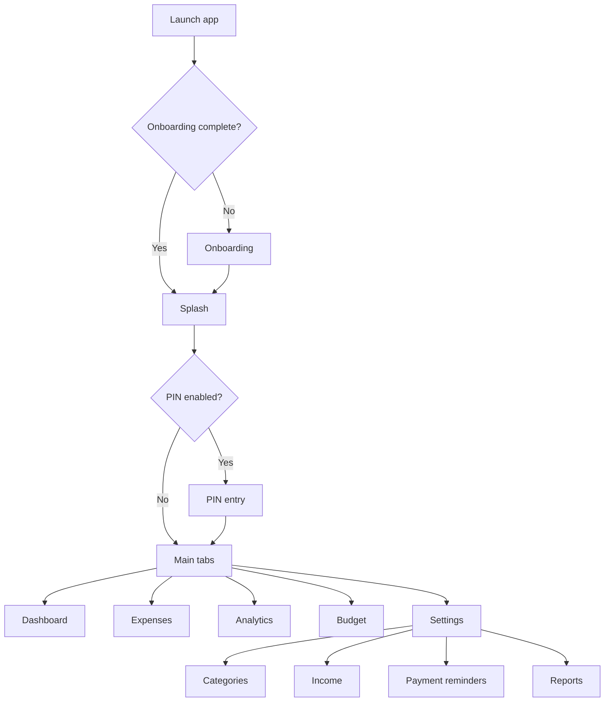
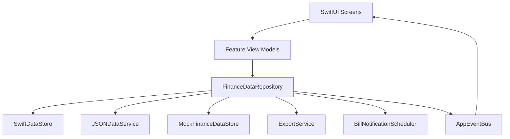

# Fintrax

Fintrax is a local-first personal finance iOS app built with SwiftUI. It helps users track expenses, review spending behavior, manage budgets, record income, schedule payment reminders, generate reports, and use a lightweight in-app assistant for quick financial insights.

The app is designed for private, practical money management without requiring bank aggregation, cloud sync, or external AI services.

## Overview

| Item | Details |
| --- | --- |
| Product type | Personal finance and expense tracking app |
| Platform | iOS |
| Minimum OS | iOS 17.0 |
| Language | Swift |
| UI framework | SwiftUI |
| Persistence | SwiftData with JSON service compatibility |
| Notifications | Local notifications and badge updates |
| Reports | PDF and CSV export |
| Intelligence | Smart category detection, rule-based insights, Fintrax Assistant |
| Architecture | Feature-oriented SwiftUI, MVVM-style view models, repository facade, event bus |
| Bundle ID | `com.ashishlanghe.ExpenseTracker` |

## Product Goals

| Goal | How Fintrax Supports It |
| --- | --- |
| Track daily expenses | Add, edit, delete, search, sort, filter, and categorize expense records |
| Understand spending behavior | Dashboard summaries, category breakdowns, monthly trends, and calendar insights |
| Stay within budget | Monthly budget progress, safe daily spend guidance, and risk indicators |
| Review cash flow | Income tracking, spending totals, and net balance summaries |
| Avoid missed payments | Payment reminders with due dates, paid state, notifications, and badge counts |
| Demo safely | Developer-only mock data mode that does not delete real data |
| Export records | PDF reports and CSV exports for review, sharing, and personal records |

## Core Features

| Feature | Description | Primary Area |
| --- | --- | --- |
| Expense tracking | Create, update, delete, search, filter, and sort expense entries | Expenses |
| Smart category suggestion | Detects a likely category from the expense title | Add/Edit Expense |
| Dashboard snapshot | Shows monthly spend, income, net balance, reminders, and budget state | Dashboard |
| Money Snapshot card | Compact summary for spending, entries, and net balance | Dashboard |
| Priority Brief | Highlights budget and bill items that need attention | Dashboard |
| Calendar month view | Displays month-level spending by date | Expenses |
| Day detail sheet | Opens expenses for a selected calendar date | Expenses |
| Category analytics | Shows spending distribution by category | Analytics |
| Monthly trend | Presents labeled spend movement across months | Analytics |
| Spending story | Summarizes current spending behavior in a concise format | Analytics |
| Budget intelligence | Explains budget usage, spending pace, and daily adjustment | Budget |
| Income tracking | Records salary, freelance, refund, and other inflows | Settings / Finance |
| Payment reminders | Tracks bills, due dates, reminders, repeat behavior, and paid state | Settings / Finance |
| PDF report export | Generates professional financial reports with summary and charts | Settings / Reports |
| CSV export | Exports expenses for spreadsheet workflows | Settings / Reports |
| PIN security | Optional 6-digit privacy gate | Settings / Security |
| Theme support | Supports system, light, and dark appearance | Settings |
| Fintrax Assistant | Animated assistant that answers quick finance questions | Dashboard / Analytics |
| Developer demo mode | Hidden mock-data mode for safe app demos | Settings |

## Fintrax Assistant

Fintrax includes an animated assistant presence that appears on insight-heavy screens. On the Dashboard, the assistant arrives with animation, shows a short greeting, and opens a bottom sheet with quick finance questions.

| Assistant Service | What It Answers |
| --- | --- |
| Highest spend day | Finds the date with the highest recorded spending in the current month |
| Best saving day | Finds the lowest recorded spend day in the current month |
| Food this month | Summarizes food-category spend and its share of total spend |
| Budget risk | Shows budget usage, projected month-end spend, and safe daily spend |
| Income vs spend | Compares income, spending, and net balance |
| Frequent spends | Detects repeated expense titles and recurring habits |

Assistant behavior:

- Uses local app data through `FinanceDataRepository`.
- Works with both real data and developer mock data.
- Uses deterministic, rule-based calculations.
- Does not call an external AI provider.
- Presents actionable suggestions instead of generic responses.

## Smart Category Detection

Smart category detection helps reduce manual work during expense entry. When the user types an expense title, Fintrax attempts to infer the most relevant category.

| Expense Title Example | Suggested Category |
| --- | --- |
| `Petrol refill` | Transportation |
| `Metro recharge` | Transportation |
| `Tomatoes and vegetables` | Food |
| `Office lunch` | Food |
| `Birthday party` | Entertainment |
| `Movie tickets` | Entertainment |
| `Electricity bill` | Utilities |
| `Medicines` | Health |
| `Amazon order` | Shopping |
| `Daily needs` | Shopping / Other |

If no reliable match is found, the user can manually select a category.

## Dashboard

The Dashboard is built for fast scanning. It gives the user a high-level financial pulse before they move into deeper analysis.

| Dashboard Section | Purpose |
| --- | --- |
| Money Snapshot | Total spend, entry count, and net balance |
| Insight Strip | Top category, average transaction, and bill status |
| Budget Left | Remaining monthly budget and days left |
| Income Card | Current period income |
| Priority Brief | Actionable budget and reminder items |
| Financial Pulse | Spend, income, net flow, budget progress, and transaction context |
| Assistant Entry | Animated assistant with greeting and quick access to insights |

## Expenses

| Area | Purpose |
| --- | --- |
| List view | Main transaction feed with search, filters, sorting, and expense actions |
| Month view | Calendar-style monthly spending overview |
| Date selection | Opens a sheet with expenses for the selected calendar day |
| Add/Edit flow | Validated expense form with smart category suggestion |
| Empty states | Guides the user when no data exists |

## Analytics

Analytics focuses on compact, actionable presentation rather than long repeated lists.

| Component | Purpose |
| --- | --- |
| Spending Story | Summarizes the current spending pattern |
| Category Breakdown | Shows category contribution and distribution |
| Monthly Trend | Shows spending movement with labels and values |
| Recent Events | Presents recent finance activity in a structured format |
| Local Insights | Highlights practical observations from available data |

## Budget Intelligence

Budget intelligence turns budget tracking into guidance.

| Signal | Example Output |
| --- | --- |
| Budget usage | `82% used with 12 days left` |
| Spending pace | `You are spending faster than the calendar pace` |
| Projected spend | `At this pace, month-end spend may reach Rs 48,000` |
| Safe daily spend | `Keep daily spend near Rs 900 to stay within budget` |
| Daily adjustment | `Reduce daily spend by about Rs 180` |
| Healthy pace | `You are spending slower than expected for this point in the month` |

## Income And Reminders

| Service | Capabilities |
| --- | --- |
| Income tracking | Add, edit, delete, and summarize income records |
| Bill reminders | Add due date, amount, note, reminder time, and paid state |
| Alert style | Supports sound/vibration style and silent badge style |
| Repeat until paid | Continues reminder behavior until the bill is marked paid |
| Badge updates | Keeps app badge aligned with actionable reminders |

> iOS controls final notification sound and vibration behavior. Fintrax uses supported local notification APIs.

## Reports And Export

| Export Type | Details |
| --- | --- |
| PDF report | Summary cards, category analytics, monthly trend, recent expenses, upcoming bills, watermark, verified stamp |
| CSV export | Expense data for spreadsheet workflows |
| Preview-first flow | Users generate, preview, and then share reports |
| Report scope | Supports date and category based report configuration |

## Developer Demo Data

Fintrax includes a hidden developer-only data mode for demos and testing. It allows the developer to switch between real data and seeded mock data without deleting real user records.

| Mode | Behavior |
| --- | --- |
| Real data | Uses the user's actual local records |
| Mock data | Uses demo expenses, budgets, income, and reminders |

Developer access flow:

1. Open Settings.
2. Tap anywhere on the top Control Center card 5 times.
3. A small progress chip appears, such as `Developer access 1/5`.
4. On the fifth tap, the mock/real data popup opens.

Developer actions:

- Enable mock data.
- Disable mock data.
- Reset mock data.
- Continue using real data without deleting it.

## App Flow



## Architecture

Fintrax uses a feature-oriented SwiftUI structure. Screens own UI state, view models coordinate feature behavior, and shared data access flows through a repository facade.

| Layer | Responsibility |
| --- | --- |
| `ExpenseTracker/AppEntry` | App launch, onboarding routing, PIN routing, tab shell, lifecycle handling |
| `ExpenseTracker/Features` | Dashboard, Expenses, Analytics, Budget, Settings, Finance, Security, Onboarding |
| `ExpenseTracker/Features/Shared` | Design system, reusable components, assistant UI, validation, modifiers |
| `ExpenseTracker/Core/Models` | Expense, Category, Budget, Income, Reminder, Settings, supporting value types |
| `ExpenseTracker/Core/Data` | `FinanceDataRepository`, `MockFinanceDataStore`, `DeveloperDataMode`, `AppEventBus` |
| `ExpenseTracker/Core/Services` | Persistence, export, smart category, category, budget, configuration services |
| `ExpenseTracker/Core/Notifications` | Reminder scheduling and badge calculation |
| `ExpenseTracker/Core/Navigation` | Navigation and tab state |
| `Tests` | XCTest coverage for model and service behavior |



## Data Model Overview

| Model | Purpose |
| --- | --- |
| `Expense` | Spending entry with title, amount, date, category, note, and timestamps |
| `Category` | Expense grouping with icon, color, default/custom state |
| `Budget` | Category-specific monthly spending limit |
| `MonthlyBudget` | Overall monthly budget state |
| `IncomeRecord` | Income entry with source, amount, date, and note |
| `BillReminder` | Payment reminder with due date, amount, paid state, and notification settings |
| `AppSettings` | Theme, security, onboarding, and app preferences |

## Project Structure

```text
Fintrax/
+-- ExpenseTracker/
|   +-- AppEntry/
|   +-- Core/
|   |   +-- Data/
|   |   +-- Models/
|   |   +-- Navigation/
|   |   +-- Notifications/
|   |   +-- Services/
|   +-- Features/
|       +-- Analytics/
|       +-- Budget/
|       +-- Categories/
|       +-- Dashboard/
|       +-- Expenses/
|       +-- Finance/
|       +-- Onboarding/
|       +-- Security/
|       +-- Settings/
|       +-- Shared/
+-- Assets.xcassets/
+-- Tests/
+-- ExpenseTracker.xcodeproj/
+-- README.md
```

## Getting Started

| Requirement | Version |
| --- | --- |
| Xcode | 15 or newer recommended |
| iOS | 17.0 or newer |
| Swift | Xcode-provided Swift toolchain |

### Run In Xcode

1. Open `ExpenseTracker.xcodeproj`.
2. Select the `ExpenseTracker` scheme.
3. Choose an iOS simulator or device running iOS 17.0 or newer.
4. Build and run.

### Command-Line Build

```bash
xcodebuild -project ExpenseTracker.xcodeproj \
  -scheme ExpenseTracker \
  -destination 'generic/platform=iOS' \
  CODE_SIGNING_ALLOWED=NO \
  build
```

### Run Tests

```bash
xcodebuild test \
  -project ExpenseTracker.xcodeproj \
  -scheme ExpenseTracker \
  -destination 'platform=iOS Simulator,name=iPhone 16'
```

## Quality And Testing

| Test Area | Coverage Examples |
| --- | --- |
| Expense model | Validation, updates, formatting, date helpers |
| Category service | Default rules, custom categories, dependency checks |
| Data service | Save, load, update, delete, missing-record behavior |
| Smart category | Keyword-based suggestion behavior |
| Budget | Usage percentage, remaining budget, recommended daily spend |
| Reports | Export configuration and report generation paths |

## Privacy Position

| Privacy Area | Position |
| --- | --- |
| Core data | Stored locally on device |
| Assistant insights | Generated locally from app data |
| Smart category | Rule-based local matching |
| External AI | Not required for current assistant behavior |
| Bank aggregation | Not part of current scope |
| Cloud sync | Not part of current scope |

## Current Scope

| Supported | Not Currently Included |
| --- | --- |
| Manual expense entry | Bank account aggregation |
| Local analytics | Server-hosted financial profiles |
| Local assistant insights | External AI chat provider |
| Local notifications | Guaranteed background vibration control |
| PDF and CSV exports | Cloud report sync |
| Developer mock data | End-user mock-data switch |

## License

This project is available under the license included in [LICENSE](LICENSE).
