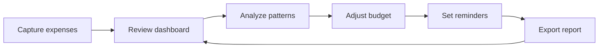
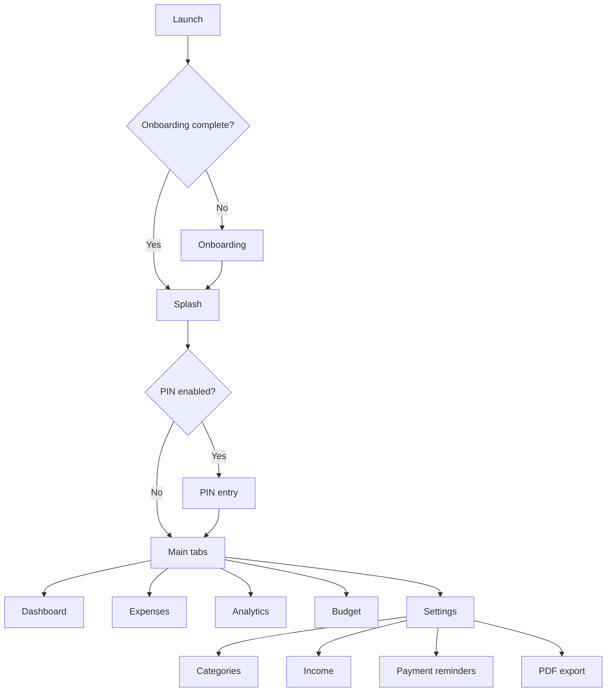
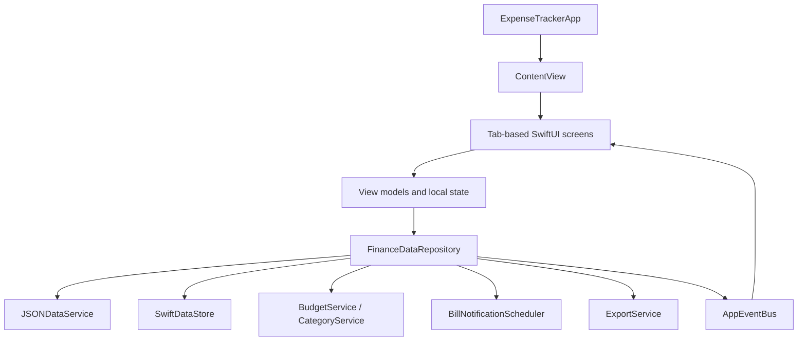

# Fintrax

Fintrax is a local-first personal finance iOS app built with SwiftUI. It helps users track expenses, manage budgets, organize categories, record income, schedule payment reminders, review analytics, and export verified financial reports from one polished mobile workspace.


## At a Glance

| Area | Details |
| --- | --- |
| Product | Personal finance, expense tracking, budgeting, analytics, reminders, reporting |
| Platform | iOS |
| Minimum OS | iOS 17.0 |
| Language | Swift |
| UI | SwiftUI |
| Persistence | SwiftData plus JSON service compatibility for legacy/local data flows |
| Notifications | UserNotifications with reminder scheduling and badge updates |
| Reporting | CSV export and verified PDF financial reports |
| Architecture | Feature-oriented SwiftUI, MVVM-style view models, repository facade, event bus |
| Version | 1.0 |
| Bundle ID | `com.ashishlanghe.ExpenseTracker` |

## Product Focus

Fintrax is designed for people who want a clear, private, and visual way to understand day-to-day spending without requiring bank aggregation or cloud sync. The app keeps core finance workflows close at hand while moving lower-frequency tools into Settings so the tab bar stays focused.



## Core Capabilities

| Capability | What It Provides | Primary Screens |
| --- | --- | --- |
| Expense Tracking | Add, edit, delete, search, filter, and sort transactions | Expenses, Add/Edit Expense |
| Dashboard | High-level monthly status, spending summary, budget context, income snapshot, reminder indicators | Dashboard |
| Analytics | Category breakdowns, monthly trends, recent activity, and on-device AI-style insights | Analytics |
| Budgeting | Monthly budget creation, updates, deletion, remaining budget, and progress visualization | Budget |
| Categories | Default and custom categories with icon and color customization | Settings, Categories |
| Income Tracking | Salary, freelance, refund, and other inflow records for cash-flow context | Settings, Income Tracking |
| Payment Reminders | Due dates, notification timing, repeat-until-paid behavior, badge count, and completion state | Settings, Payment Reminders |
| PDF Reports | Date/category scoped reports with preview, sharing, verified stamp, watermark, charts, and recent activity | Settings, PDF Report |
| Security | Optional 6-digit PIN gate on launch or app return | Settings, PIN |
| Appearance | System, light, and dark theme support | Settings |

## App Flow



## Screens

| Screen | Purpose | Key Details |
| --- | --- | --- |
| Splash | Branded startup and return experience | Animated finance visuals, transition into security or app shell |
| Onboarding | Introduces the product value | Expense tracking, insights, reports, privacy-friendly workflow |
| PIN | Optional privacy gate | 6-digit PIN setup, entry, and change flow |
| Dashboard | Quick financial status | Summary cards, budget context, income and reminder signals |
| Expenses | Transaction workspace | Search, filter, sort, refresh, add/edit/delete, empty states |
| Analytics | Deeper financial understanding | Date range, charts, category drill-down, local AI Analyze |
| Budget | Monthly spending plan | Budget limit, remaining budget, progress, guidance cards |
| Settings | Control center | Finance tools, theme, PIN, device info, app info, onboarding replay |
| Categories | Category management | Default/custom categories, SF Symbols, color editing |
| Income Tracking | Inflow management | Income records, monthly summary, add/edit/delete |
| Payment Reminders | Bill and payment alerts | Alert style, repeat handling, test alert, paid/unpaid state |
| PDF Report | Verified export workflow | Configure, generate, preview, then share |

## Technical Highlights

| Area | Implementation |
| --- | --- |
| Feature Structure | App code is grouped by capability under `ExpenseTracker/Features` |
| State Management | SwiftUI state tools plus dedicated view models for complex screens |
| Data Access | `FinanceDataRepository` provides a single facade for feature screens |
| Synchronization | `AppEventBus` publishes expense, budget, category, income, and reminder changes |
| Persistence | SwiftData-backed local storage with JSON service compatibility and backup support |
| Notifications | Local notification scheduling, cancellation, foreground presentation, and badge state |
| Reports | `UIGraphicsPDFRenderer` for PDF output and PDFKit for in-app preview |
| Design System | Shared color, spacing, typography, card, background, and animation components |
| Testing | XCTest coverage for model and service behavior |

## Architecture

Fintrax follows a feature-oriented SwiftUI architecture with MVVM-style state ownership, a repository facade for finance data, isolated services for side effects, and event-driven refreshes between screens.



### Main Layers

| Layer | Responsibility |
| --- | --- |
| `ExpenseTracker/AppEntry` | App entry, onboarding/PIN routing, tab shell, lifecycle hooks |
| `ExpenseTracker/Features` | User-facing SwiftUI screens and feature view models |
| `ExpenseTracker/Features/Shared` | Reusable UI components, design system, validation, modifiers |
| `ExpenseTracker/Core/Models` | Domain models, supporting value types, SwiftData models |
| `ExpenseTracker/Core/Data` | Repository facade and app-wide event bus |
| `ExpenseTracker/Core/Services` | Persistence, export, configuration, budget, category, and data services |
| `ExpenseTracker/Core/Notifications` | Local reminder scheduling and badge calculation |
| `ExpenseTracker/Core/Navigation` | Tab selection and navigation state |
| `Tests` | XCTest model and service tests |

## Data Model Overview

| Model | Purpose |
| --- | --- |
| `Expense` | Individual spending records with amount, title, date, category, and note data |
| `Category` | Expense grouping with default/custom metadata, icon, and color information |
| `Budget` / `MonthlyBudget` | Spending limits and monthly budget state |
| `IncomeRecord` | User income and cash-flow records |
| `BillReminder` | Scheduled payment reminders, paid state, and notification metadata |
| `AppSettings` | Theme, security, and export defaults |

## Reporting

Fintrax supports both CSV expense export and richer PDF financial reports. PDF export is intentionally review-first: users configure the report, generate it, preview it in the app, and only then share it.

| Report Feature | Details |
| --- | --- |
| Scope | All data or selected category |
| Filtering | Date range and category selection |
| Content | Summary cards, category analytics, monthly trend, recent expenses, upcoming bills |
| Branding | `Verified by Fintrax` stamp and subtle FINTRAX watermark |
| Rendering | Print-safe PDF colors independent of app light/dark theme |
| Sharing | SwiftUI share flow from the preview screen |

## Notifications

Payment reminders use system-supported local notifications. Fintrax schedules due-date alerts, supports repeat-until-paid reminders, updates the app icon badge, and cancels stale notifications when reminders are completed or deleted.

| Alert Style | Behavior |
| --- | --- |
| Sound + Vibration | Uses local notification sound; final vibration behavior is controlled by iOS |
| Silent Badge | Updates reminder/badge state without an audible alert |

> iOS does not allow apps to force arbitrary background vibration or custom ringtone playback. Fintrax stays within system notification behavior.

## Local AI Analyze

AI Analyze is an on-device insight experience. It does not call an external AI provider. It summarizes local spending and income data into practical finance observations.

| Insight Type | Example Signal |
| --- | --- |
| Category Focus | Most-spent category and category concentration |
| Spending Pace | Average daily spend and projected period spend |
| Timing Pattern | Peak spending day and lowest-spend day |
| Transaction Risk | Largest transaction and notable outliers |
| Cash Flow | Savings rate when income data exists |
| Recommendations | Practical suggestions based on current spending behavior |

## Project Structure

```text
Fintrax/
+-- ExpenseTracker/
|   +-- AppEntry/
|   +-- Core/
|   |   +-- Data/
|   |   +-- Models/
|   |   +-- Navigation/
|   |   +-- Notifications/
|   |   +-- Services/
|   +-- Features/
|       +-- Analytics/
|       +-- Budget/
|       +-- Categories/
|       +-- Dashboard/
|       +-- Expenses/
|       +-- Finance/
|       +-- Onboarding/
|       +-- Security/
|       +-- Settings/
|       +-- Shared/
+-- Tests/
+-- Assets.xcassets/
+-- openspec/
+-- ExpenseTracker.xcodeproj/
+-- README.md
```

## Getting Started

### Requirements

| Requirement | Version |
| --- | --- |
| Xcode | 15 or newer recommended |
| iOS | 17.0 or newer |
| Swift | Xcode-provided Swift toolchain |

### Run Locally

1. Open `ExpenseTracker.xcodeproj` in Xcode.
2. Select the `ExpenseTracker` scheme.
3. Choose an iOS simulator or device running iOS 17.0 or newer.
4. Build and run.

Command-line build:

```bash
xcodebuild -project ExpenseTracker.xcodeproj \
  -scheme ExpenseTracker \
  -destination 'generic/platform=iOS' \
  CODE_SIGNING_ALLOWED=NO \
  build
```

Run tests:

```bash
xcodebuild test \
  -project ExpenseTracker.xcodeproj \
  -scheme ExpenseTracker \
  -destination 'platform=iOS Simulator,name=iPhone 16'
```

## Quality & Testing

| Test Area | Coverage Examples |
| --- | --- |
| Expense Services | Save, load, update, delete, and missing-record behavior |
| Category Rules | Default category restrictions, rename/delete validation, dependency checks |
| Budget Models | Budget creation and persistence behavior |
| Data Services | Temporary-directory test configuration and backup-disabled test setup |

## OpenSpec Workflow

Fintrax was shaped with a spec-driven workflow using OpenSpec. Product behavior, acceptance expectations, and implementation tasks were documented before and during development, which helped keep the app modular as it grew from expense tracking into budgeting, analytics, reminders, security, and reports.

| OpenSpec Use | Result |
| --- | --- |
| Feature discovery | Converted broad finance ideas into defined app modules |
| Screen ownership | Kept the main tab bar focused while moving tools into Settings |
| Data-flow planning | Clarified repository, event bus, and persistence responsibilities |
| UI refinement | Aligned visual improvements with a professional finance product |
| Notification behavior | Captured system limits, badge updates, repeat reminders, and completion flows |
| Report generation | Defined preview-first export, selected scopes, verified stamp, watermark, and charts |

## Privacy Position

Fintrax is local-first by design. Expense, budget, income, category, reminder, settings, and analysis data are handled on device. The AI Analyze experience is rule-based and local, and the app does not require external AI services for financial insights.

## License

This project is available under the license included in [LICENSE](LICENSE).
